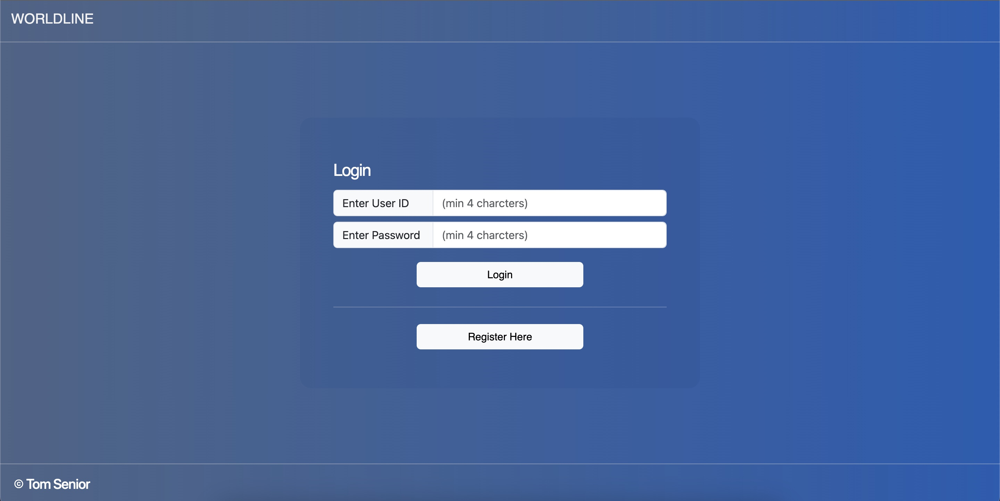
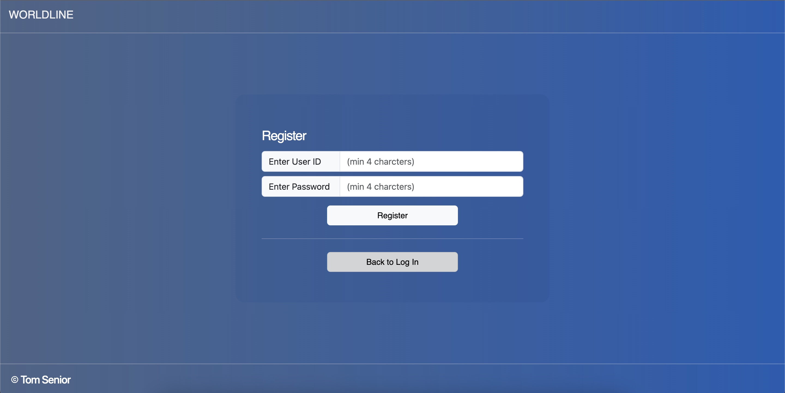
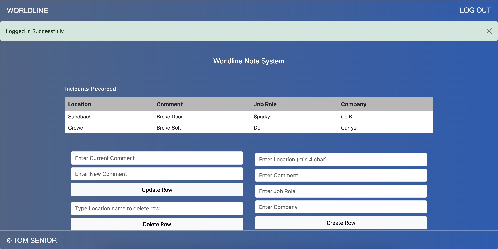
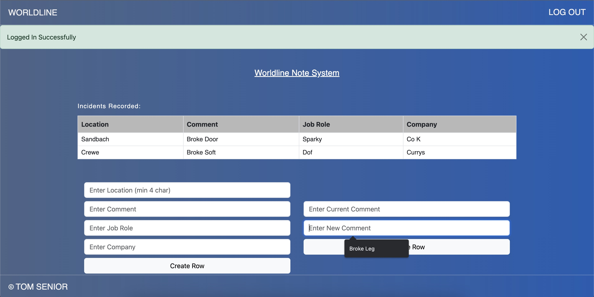

# Introduction

Hello i'm Tom Senior, this project will deliver all the outlined criteria below.

# Summary of Web Application

The Purpose of this application was to solve the following issues currently faced with our process in logging support tickets.

- Process is currently done manually, leading to confused documentation about what is expected.
- No structure if the tickets have been assigned or not to a work group.
- No option to update the tickets.

This solution will solve all the above outlined issues, and will become more of a structured solution allowing for more transparacy.

## Current Process

The Current process was done manually, therefore this system should be in replacement to update the manual paper equivalent and provide the correct way of logging tickets.

By Defuault the user will be set to non admin, if the user requires support please contact Admin.

## The application will be established around the two following level of users.

### By Default the user will be assigned to a Non Admin, to apply to the principle of lease privilege.

1. Non admin
2. Admin.

The level of user will determine what buttons will display on the page where the data is rendered. The following privileges will be enabled for user.

1. Non Admn user should have CRU Access, which will allow Create,Read, Update.
2. Admin should have full Create,Read, Delete Access to the data, the Read is covered under the rendering of the data on the page.

## This application will provide the ability to do the two following actions:

1. Log In ( if the user is already exists )
2. Register ( \*\* By Default the user will be set to none Admin, SQL Scripts are ran against it when authorized )

### Loging In Page

### Loging In Page

## The Functionality of the Main Home page

For this main home page, will differ based on the level of user you have signed in with. For example if you've signed in with an admin user, you will be able to see all of the buttons shown below. However, non admin will not have the delete option present.

The Data will automatically be re-rendered, upon action being completed.

### The Image Below is for an admin user ( Please not the black lines, are redacted information)

### The Image Below is for an non Admin user ( Please not the black lines, are redacted information)

# Create Virtual Environment

- python3 -m venv <name of environment>

# Activating the Environment

Ensuring this is activated, if you are pulling the environment. Without this being activated it might lead to errors with running the enviroment.

- source venv/bin/activate

# Intall Dependancies

- python3 install flask
- python3 install sqlite3

# Run Environment via the Source code

The code can either be ran via the following two options:

1. python3 main.py
2. debugger window - via the flask application.
3. it will then provide a IP in the terminal which will normally be host :5000

# Example of how to activate the sqlite3

1. Access Terminal
2. type in sqlite3 database.db (database.db is the name of my DB, this value could differ)
3. This will then run the sqlite3 in terminal
4. An SQLLite Explorer will be present on the bottom left to where the database and contents can be seen
5. via the sqllite3 terminal you can enter the below insert script or .tables to show all the present tables in the database.
6. Alternatively you can see all data present in the tables, via SQL Explorer and right click on the table and click "show Table"

# example doesn't include id, due to being auto incrementing

- INSERT INTO data (LOCATION, COMMENT) VALUES ('Crewe', 'Old Office Location');
- INSERT INTO assignmentGroup (LOCATION, JOBROLE,COMPANY) VALUES ('Crewe', 'PLUMBER', 'PLUMBERCO');

# Things to note

1. For the data to display on the page, this should be set up prior to accessing. However, Please note if this table is empty, you will have to login as an admin user and you can create your own data and insert it into the table.
2. If Admin = yes, upon logging into the web_app you will be able to see the buttons to perform the following steps:

- update
- delete
- insert

3. If admin is "no", you will just be able to see the rendered data. With a message showing "You have read only permisions"

# Unit Tests - (Completed only )

Can be accessed via the test directory
Please note there is one which has been commented out - for future development.

1. check_login - tests/testLogin.py
2. check_register - tests/testRegister.py

# Can run test via the following command

1. Ensure your in the main parent directory ( run PWD in terminal to check )

# Alternatively if you are cloning the code into Visual Studio code, the testing window is avaliable down the left hand side of the page.

## Run Register

- python3 -m tests.testRegister_test

## Run Login

- python3 -m tests.testLogin_test
