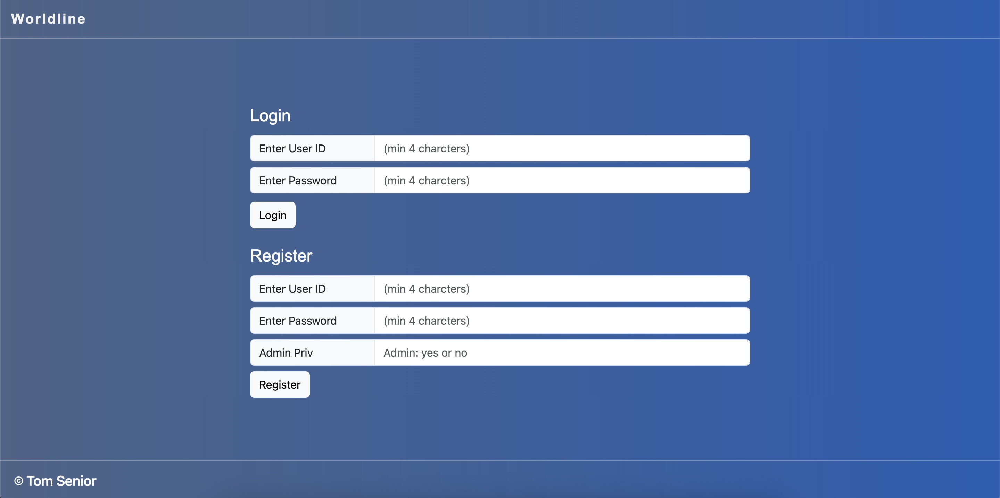

# Summary of Web Application
Hello, Welcome to my application. 

The purpose of this application, was to solve a current issue with logging of issues or comments within Worldline at a certain Job role.

## This application will provide the ability to do the two following actions:

1. Log In ( if the user is already exists )
2. Register ( provide the user with the ability to register and allow admin or not)

# Create Virtual Environment
python3 -m venv <name of environment>
# Activating the Environment
source venv/bin/activate
# Intall Dependancies
python3 install flask
python3 install sqlite3

# Run Environment via the Source code
The code can either be ran via the following two options:

1) python3 test.py
2) debugger window - via the flask application.
3) it will then provide a IP in the terminal which will normally be host :5000

# Example of how to activate the sqlite3

1) Access Terminal 
(This is the name of the Database)
2) type in sqlite3 database.db 
3) This will then run the sqlite3 in terminal
4) An SQLLite Explorer will be present on the bottom left to where the database and contents can be seen
5) via the sqllite3 terminal you can enter the below insert script or .tables to show all the present tables in the database.
6) Alternatively you can see all data present in the tables, via SQL Explorer and right click on the table and click "show Table"

# example doesn't include id, due to being auto incrementing
INSERT INTO data (LOCATION, COMMENT) VALUES ('Crewe', 'Old Office Location');
INSERT INTO assignmentGroup (LOCATION, JOBROLE,COMPANY) VALUES ('Crewe', 'PLUMBER', 'PLUMBERCO');

# Things to note 
For the data to display on the page, this should be set up prior to accessing. However, Please note if this table is empty, you will have to login as an admin user and you can create your own data and insert it into the table.

2) If Admin = yes, upon logging into the web_app you will be able to see the buttons to perform the following steps:

- update 
- delete
- insert

3) If admin is "no", you will just be able to see the rendered data. With a message showing "You have read only permisions"

# Unit Tests - (Completed only ) 
Can be accessed via testing.py - Have creates some test scenarios for each 
Please note there is one which has been commented out - for future development.

1) check_login (auth.py)
2) check_register (auth.py)

# Can run test via the following command
- python3 testing.py
